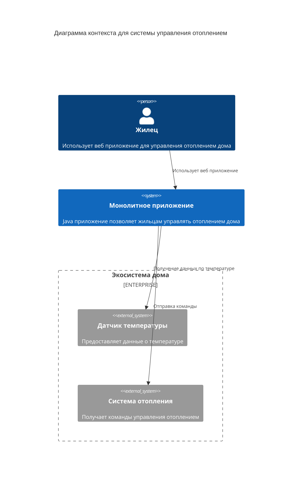

## Анализ и планирование

### Функциональные требования
- управление отоплением - пользователи могут удалённо включать/выключать отопление в своих домах.
- мониторинг температуры - система получает данные о температуре с датчиков, установленных в домах. Пользователи могут просматривать текущую температуру в своих домах через веб-интерфейс.
### Технические требования
- язык программирования: Java
- база данных: PostgreSQL
### Домены
#### Домен управления отоплением

Управление системой отопления в доме, включение/выключение. Отвечает за отправку команд на устройства, которые находятся в дому у жильца
#### Домен мониторинга температуры

Сбор и отображение данных по температуре с датчиков, которые установлены в доме. Отвечает за получение данных по температуре в дома

### Проблемы

- синхронность - так как в монолите все синхронно, то это может вызвать проблемы с запросами в монолит, например, некоторые запросы могут обрабатываться очень долго, тем самым, блокировав обработку других запросов
- каждая установка сопровождается выездом специалиста - для обеспечения простоты, пользователю не хватает функционала по возможности самостоятельно добавлять/удалять датчики
- время отклика системы при росте может значительно вырасти
- если у нас монолитное приложение состоит из 1 инстанса, то мы можем получить единую точку отказа
- единый стек технологий - монолит привязан к конкретной технологии, что может вызвать проблему с внедрением новых технологий
### Текущая схема

