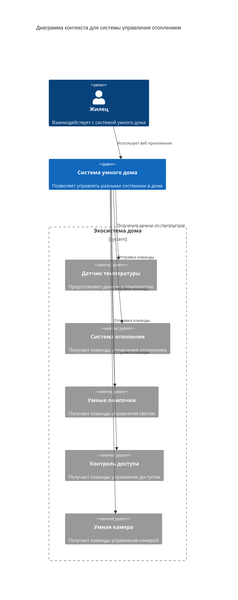
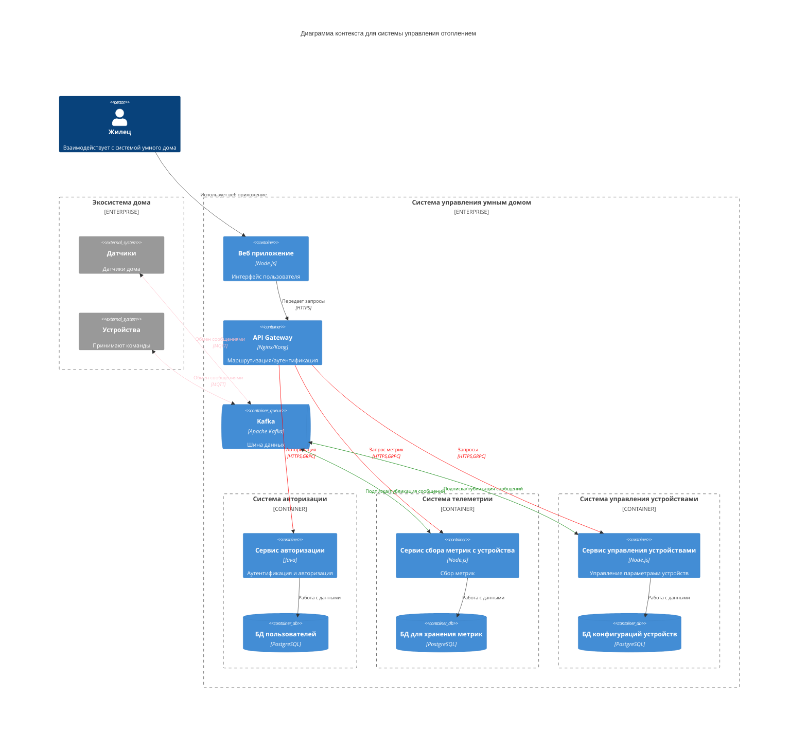
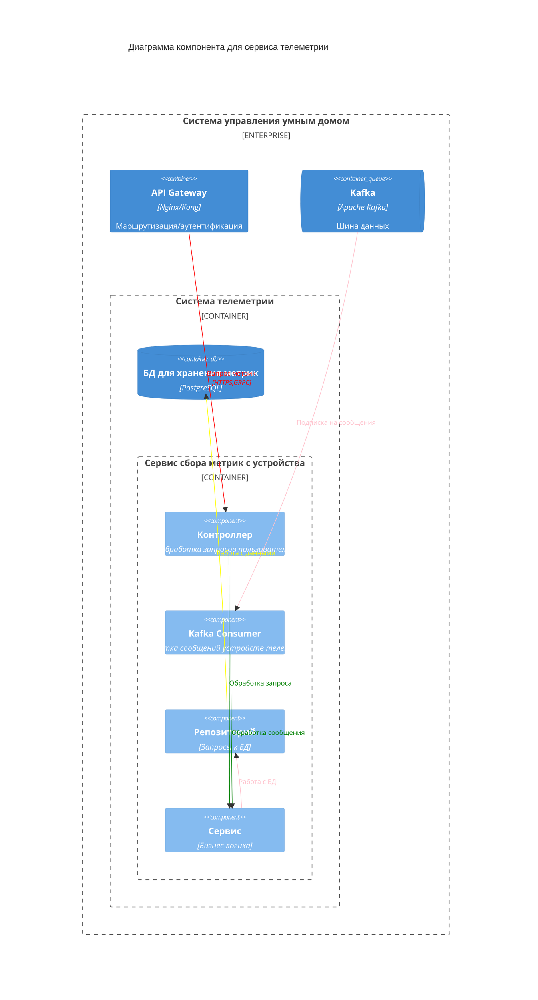
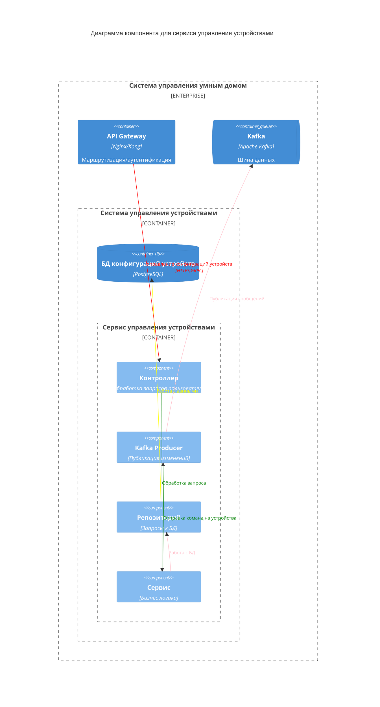
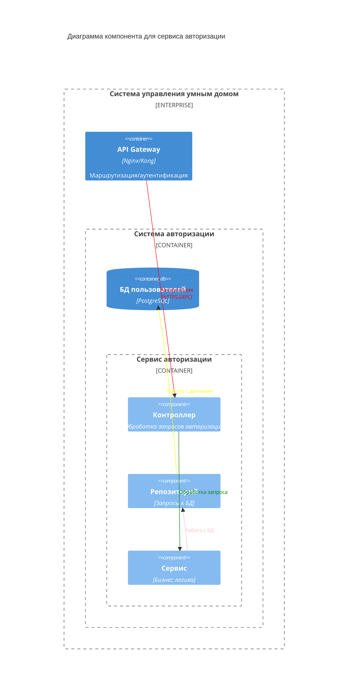
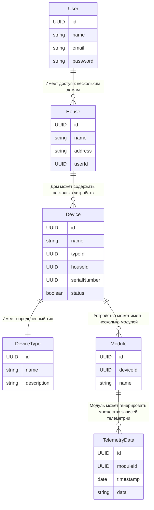

## Проектирование микросервисной архитектуры

### Функциональные требования

- Экосистема доступна пользователю в режиме самообслуживания по модели SaaS.
- Система позволяет управлять отоплением, включать и выключать свет, запирать и отпирать автоматические ворота, удалённо наблюдать за домом. Также в будущем могут появиться запросы на добавление новой функциональности. Решение должно быть легко расширяемым.
- Пользователь самостоятельно выбирает необходимые ему модули умного дома (устройства), сам их подключает, настраивает сценарии работы и просматривает телеметрию.
- Компания не занимается производством устройств, но поддерживает подключение к экосистеме устройств партнёров по стандартным протоколам.
- Веб-разработка передана на аутсорс и не входит в требования данной работы.
- Модули управления приборами и сами приборы (устройства) должны быть максимально готовы к использованию и продаваться в отдельных комплектах для удобной покупки и подключения.
- Устройства должны быть доступны через интернет (для удалённого наблюдения и доступа). Предполагается, что пользователь будет иметь интернет-канал, к которому их можно подключить.
- Покупатели могут программировать систему для управления различными модулями в соответствии со своими потребностями.

### Уровень контекста

### Уровень контейнеров

### Уровень компонентов для сервиса телеметрии

### Уровень компонентов для сервиса управления устройствами

### Уровень компонентов для сервиса авторизации

### ER-диаграмма

